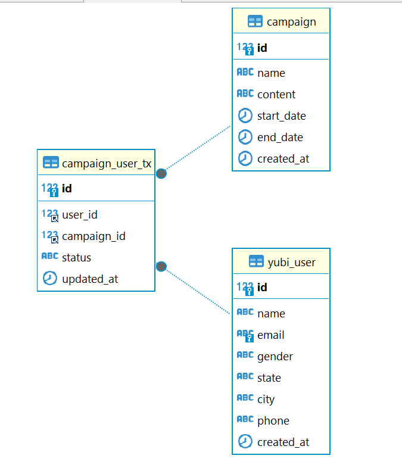

# SQL Assignment: Yubi Campaign Management System

This assignment is based on the **`yubi_user`**, **`campaign`**, and **`campaign_user_tx`** tables. Complete the following tasks to demonstrate your SQL skills in managing and querying the database.

---

## Assignment Questions

### 1. Data Insertion
Write an SQL query to insert a new user from **Mumbai** with the following details:
- **Name:** Vikram Mehta  
- **Email:** vikram.mehta@example.com  
- **Gender:** Male  
- **Phone:** +919876543216

### 2. Update Campaign
Write a query to **extend the end date** of the "New Year Sale" campaign by 5 days.

### 3. Retrieve Users
Retrieve the **list of all users** from **Ahmedabad**, displaying their name, email, and phone number.

### 4. Campaign Participation
Write an SQL query to find the **total number of users reached** by each campaign.

### 5. Responded Users
Retrieve the **names of all users** who **responded to the "Diwali Dhamaka"** campaign.

### 6. Group by State
Write a query to **count the total number of users in each state** (grouped by state).

### 7. Update User Information
Write a query to **update the phone number** of the user named "Rahul Sharma" to "+919876543299".

### 8. Delete User
Write a query to **delete a user from Pune** based on their email address.

### 9. Retrieve Campaigns
Write a query to **list all campaigns** that are **currently active** (i.e., end date is greater than the current date).

### 10. Transaction History
Retrieve the **campaign status** of the user **"Kavita Shah"** for all campaigns she participated in.

### 11. Order by City
Write a query to **list all users** from Maharashtra, sorted by **city in ascending order**.

### 12. Insert Campaign Transaction
Insert a new **campaign-user transaction** for `user_id = 3` in the **"New Year Sale"** campaign with the status "reacted".

### 13. Join Tables
Write a query to **join the `yubi_user` and `campaign_user_tx` tables** and retrieve the user names, campaign names, and statuses.

### 14. Find Reached Campaigns
Retrieve the **campaigns where all users from Pune were reached**.

### 15. Calculate Duration
Write a query to calculate the **duration (in days)** for each campaign.

### 16. Participated Campaigns
Retrieve the **list of campaigns** in which **more than 3 users participated**.

### 17. Search by Email
Write a query to **find users whose email addresses contain "example.com"**.

### 18. Latest Campaigns
Write a query to **list the 3 most recently created campaigns** based on the `created_at` timestamp.

### 19. Filter by Status
Write a query to retrieve the **number of users who reacted** to each campaign, grouped by campaign.

### 20. Delete Campaign
Write a query to **delete a campaign** whose **end date has already passed**.

---

## Submission Guidelines

- Write the SQL queries for each question and submit them in a single `.sql` or `.txt` file.
- Ensure that the queries are correctly formatted and optimized.
- Include any assumptions or additional logic if required for specific queries.

---

## Grading Criteria

- **Correctness:** Queries should return the expected results.
- **Efficiency:** Queries should be optimized for performance.
- **Formatting:** Code should be clean and easy to understand.
- **Completeness:** All questions must be attempted.
